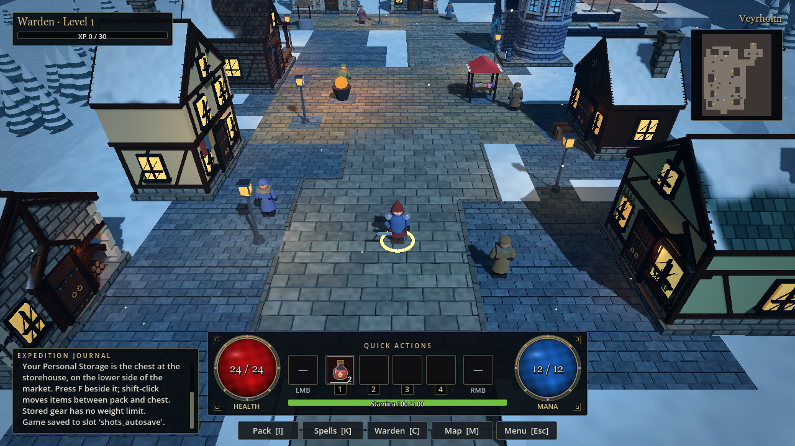
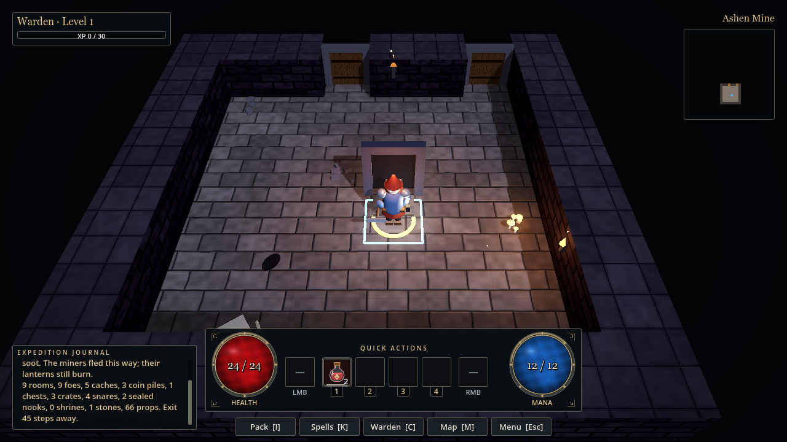

# Veyrholm — The Buried Fortress

A dark fantasy dungeon-crawling RPG set beneath a snowbound northern town.
Explore the buried fortress, fight its inhabitants, collect equipment and spells,
and return to Veyrholm to trade, recover, and prepare for the next expedition.

**[Download for Windows](https://github.com/batschu/veyrholm/releases)**

## The game

- Explore a snowy town, enter its buildings, and meet its inhabitants.
- Descend through procedural dungeon floors filled with enemies, traps, and treasure.
- Build your character with weapons, armour, spells, and loot.
- Return to town to sell your finds, upgrade your equipment, and venture deeper.

Veyrholm is in active development. Current releases are playable previews;
combat, movement, and visuals are still evolving.

## Screenshots

*Development screenshots; individual releases may look different.*

## Play on Windows

1. Open [Releases](https://github.com/batschu/veyrholm/releases) and download
   **Veyrholm-Windows-x86_64.zip** under **Assets**.
2. Extract the entire ZIP into a folder.
3. Launch **Veyrholm.exe**. Keep **Veyrholm.pck** beside it.

No Godot installation or source-code checkout is needed.
