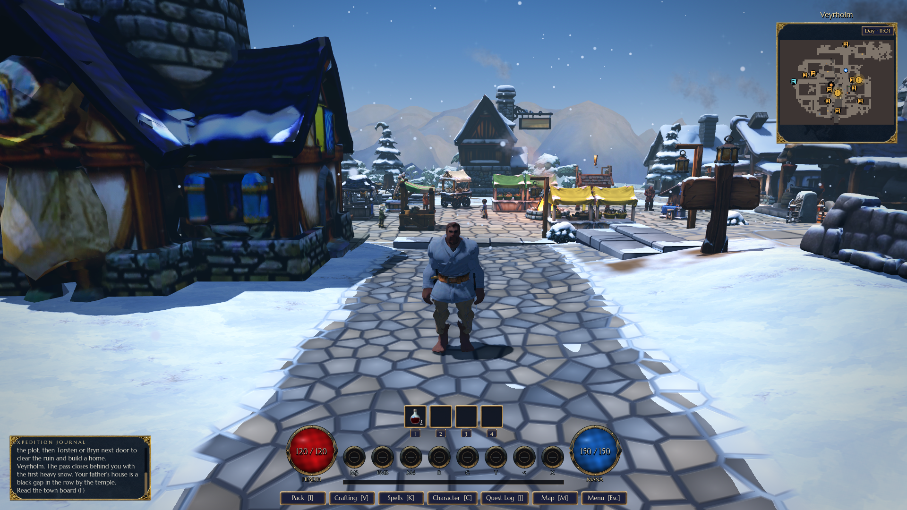
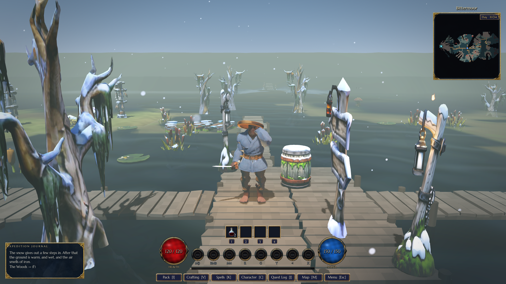
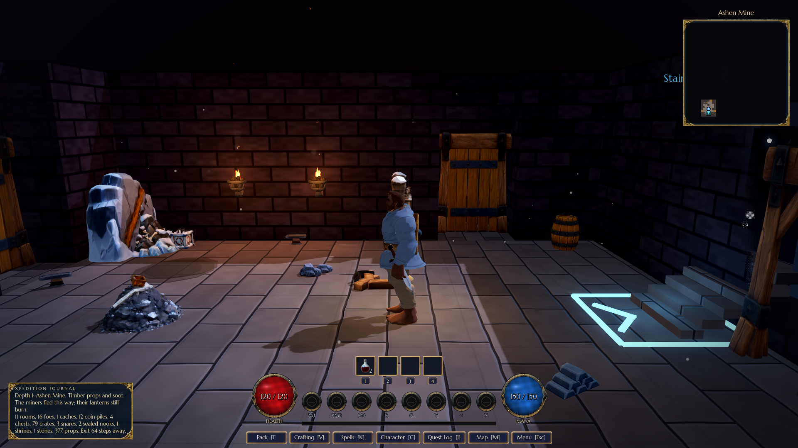
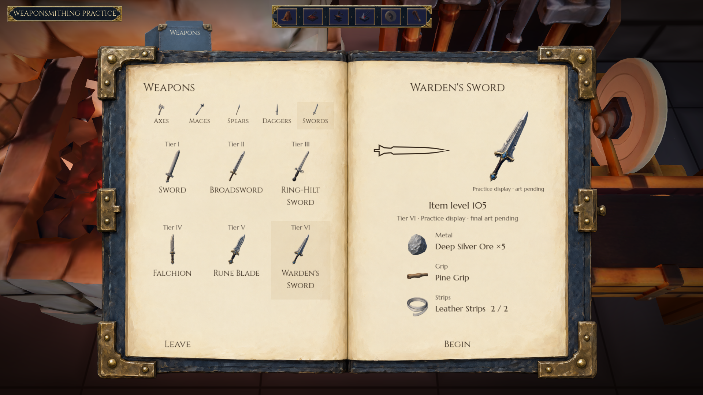
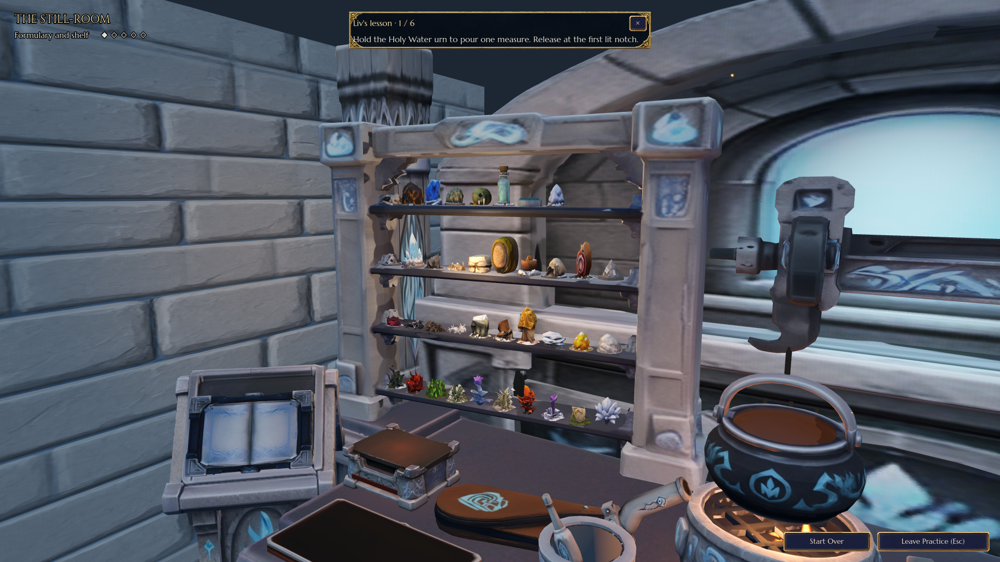

# Veyrholm — The Buried Fortress

A dark fantasy RPG in a snowbound frontier. Make a home in Veyrholm,
follow its inhabitants' troubles into the wilderness, and descend into a fortress
buried beneath the town. Fight in real time, gather supplies, and make the equipment
you carry into the next expedition.

**[Download the Windows preview — v0.1.26](https://github.com/batschu/veyrholm/releases/tag/v0.1.26)**

## A town, four wilderness regions, and a buried fortress

The preview has **six main locations**: **Veyrholm**, **Lower Slopes**,
**The Woods**, **The Rim**, **Bittermoor**, and **The Buried Fortress**.
Explore woodland paths, rocky heights, and misty marshes, with caves, cellars,
camps, and other smaller places along the way. Return to town to trade, rest,
and prepare.

The fortress descends through **eight procedural floors**: worked mine passages,
a great shaft, a buried garrison, cisterns, a blackstone sanctuary, burial galleries,
a royal procession, and broken rune halls. A distinct entrance marks the way inside,
and paired spiral stairs connect each floor to the next. Existing expeditions keep
their explored layouts while receiving the new architecture and themed furnishings.
Enemies, traps, treasure, and hidden rooms await below. The entrance opens through
the town's quest progression.
Time your attacks, blocks, parries, and rolls, and combine weapons and armour with
spells as you develop your character.

<table>
  <tr>
    <td></td>
    <td></td>
  </tr>
  <tr><td>Bittermoor</td><td>Inside the buried fortress</td></tr>
</table>

## Make your equipment by hand

Crafting takes place at workbenches with tools, materials, and distinct steps:

- **Gathering:** mine ore and cut timber for your next project.
- **Smelting and weaponsmithing:** charge the crucible, work the bellows, pour
  ingots, then heat, hammer, quench, grind, and assemble your weapon.
- **Mail, plate, and shields:** link rings, shape metal, and fit armour linings
  or shield components.
- **Carving:** saw and carve wood into handles, clubs, bows, and staves.
- **Tailoring and leatherwork:** prepare hides, spin yarn, weave cloth, cut leather
  strips, and sew clothing, leather armour, and linings. Leather set recipes use
  a lining for the same equipment slot, at the required tier or higher.
- **Alchemy:** measure reagents, grind, heat, stir, and distil at the still-room bench.

Patterns follow the shape of the item you are making. Different blades and armour
pieces have their own outlines, and recipe books group equipment by type or slot.

*All six sword tiers on one book page in Weaponsmithing Practice.*

## Learn and practise

Choose **Tutorial** on the title screen for **11 exercises** covering combat,
Mystic Arts, and the crafting trades. Mining and woodcutting share one exercise.
Crafting practice supplies the materials and exposes **all six tiers**, so you can
try the complete range and start again without using your campaign supplies.
Alchemy practice includes the full reagent kit and formulary. Mystic Arts lets you
paint and charge runes, bind stones, and test enchantments.

## Play on Windows

For [v0.1.26](https://github.com/batschu/veyrholm/releases/tag/v0.1.26), download
**every ZIP** under **Assets**:

- **Veyrholm-Windows-x86_64.zip** (the game)
- **Veyrholm-Data-01.zip**, **Veyrholm-Data-02.zip**, and every further numbered
  data ZIP.

Put them in one new folder and extract each ZIP into that same folder, then
launch **Veyrholm.exe**. There is nothing to join any more, and you do not need
Godot installed. If a data pack is missing, the game names it and closes.
Updating an older install: replace every ZIP; the data ZIPs must come from the
same version as the game.
**SHA256SUMS.txt** lists each ZIP's checksum. Customise your movement, combat,
and spell bindings under **Settings → Controls**; a controller works too, laid
out as in Dark Souls.

Veyrholm is in active development, and this is a playable preview. Some higher-tier
crafting content and Mystic Arts are currently available only in practice;
campaign content, balancing, and visuals are still evolving.

*Town, wilderness, and crafting screenshots are from v0.1.23; the dungeon view
shows the latest architecture overhaul. All screenshots are 1920 × 1080.*
